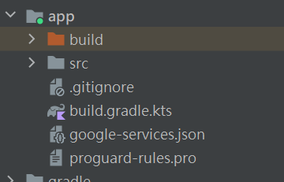

# Android Studio說明
### 1.取得google-services.json，放入app目錄底下

 

### 2.build-gradle.kts增加firebase dependencies
####build-gradle.kts(Notification app)
```kotlin
id("com.google.gms.google-services") version "4.4.2" apply false
```
####build-gradle.kts(app)
```kotlin
implementation("com.google.firebase:firebase-firestore-ktx:23.0.3")
implementation("com.google.firebase:firebase-auth-ktx:21.0.3")
implementation("com.google.firebase:firebase-messaging")
implementation(platform("com.google.firebase:firebase-bom:33.1.2"))
implementation("com.google.firebase:firebase-analytics")
```
dependencies外再增加一行
```kotlin
apply(plugin = "com.google.gms.google-services")
```
