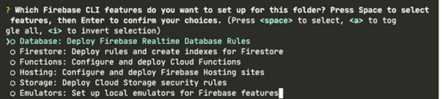
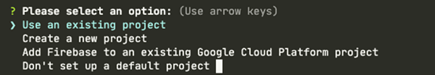
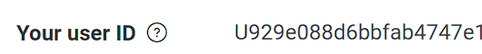
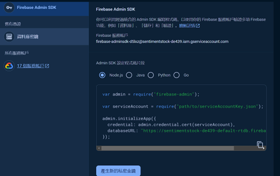
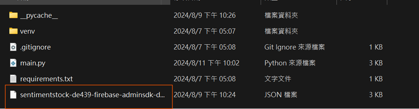

# Firebase Cloud Function
### 佈署Cloud Function(進入cmd命令提示字元)
#### 1.安裝node.js和npm
#### 2.安裝Firebase CLI
```
npm install -g firebase-tools
```
#### 3.login
```
firebase login
```
#### 4.init
```
firebase init
```
#### 5.選擇功能(選擇Functions)

#### 6.選擇要用哪個project

#### 7.語言選擇python

#### 8.按yes直到結束(裝完後此時就可以開始寫要佈署上functions的code)
#### 寫完要佈署時，先進入該資料夾(預設資料夾名functions)
```
cd functions
```
#### 佈署
```
firebase deploy
```
# LINE
#### 1.登入LINE Developers
#### 2.創建一個頻道

#### 3.前往Basic settings並滑到底部取得user id



#### 4.前往Messaging API並滑到底部取得Channel access token

#### 5.掃QRCode將頻道加好友

#### 6.將Channel access token和to_user分別填入line_token和to_user
```python
line_token = Channel access token
to_user = user id
```
#Firebase
#### 1.在firebase取得服務帳號的 JSON 檔案(點擊產生私密金鑰)



#### 2.放入functions資料夾中

#### 3.將剛取得的serviceAccountKey.json填入
```python
cred_path = os.getenv('GOOGLE_APPLICATION_CREDENTIALS', '<path/to/serviceAccountKey.json>')
```
# main.py
初始化 Firebase Admin SDK，使code能夠與 Firebase 服務互動。
cred_path：取得 Firebase 服務帳號的 JSON 檔案路徑。路徑從環境變數 GOOGLE_APPLICATION_CREDENTIALS 取得，若不存在，則使用預設值。 
cred：使用服務帳號的 JSON 檔案建立license，用於認證。 firebase_admin.initialize_app(cred)：使用上面license初始化 Firebase 應用程式。
db = firestore.client()：初始化 Firestore 用戶端，允許與 Firestore 資料庫進行互動。
```python
cred_path = os.getenv('GOOGLE_APPLICATION_CREDENTIALS', '<path/to/serviceAccountKey.json>')
cred = credentials.Certificate(cred_path)
firebase_admin.initialize_app(cred)

db = firestore.client()
```
### 發送到 LINE chatbot
send_notifications 函數負責發送通知。如果 emotion_index 大於 80，則執行通知操作。
發送到 LINE chatbot：
line_token：LINE bot 的存取令牌，用於認證請求。 
to_user：接收訊息的使用者 ID。 
message：訊息的內容，包含要傳送的情緒指數。 
headers：請求頭部訊息，包括內容類型和授權令牌。 
requests.post：向 LINE API 發送 POST 請求以推送訊息。請求失敗，則列印錯誤訊息；成功，則列印成功訊息。
```python
def send_notifications(emotion_index):
    if emotion_index is not None and emotion_index > 80:
        #發送到 LINE chatBOT
        line_token = '<Channel access token>'
        to_user = '<user id>'  # 改為接收消息的用户 ID
        message = {
            "to": to_user,
            "messages": [
                {
                    "type": "text",
                    "text": f"情緒指數超過 80: {emotion_index}"
                }
            ]
        }

        headers = {
            'Content-Type': 'application/json',
            'Authorization': f'Bearer {line_token}'             
        }

        response = requests.post('https://api.line.me/v2/bot/message/push', json=message, headers=headers)
        if response.status_code != 200:
            print(f"Error sending to LINE: {response.text}")
        else:
            print("Successfully sent message to LINE")
```
### 發送 Firebase Cloud Message (FCM)
fcm_message：建立一個 FCM 訊息對象，包含情緒指數，並將其發佈到 emotionAlerts 主題。 
messaging.send(fcm_message)：傳送 FCM 訊息，並列印成功訊息。
```python
        fcm_message = messaging.Message(
            data={
                'emotion_index': str(emotion_index),
            },            
            topic='emotionAlerts'
        )
        response = messaging.send(fcm_message)
        print(f'Successfully sent message: {response}')
```
### 發送資料到 Flask 應用
使用ngrok來生成外部url'<ngrok url>'，並將'emotion_index'傳給flask
```python
        flask_url = '<ngrok url>/notify'
        flask_data = {'emotion_index': emotion_index}
        flask_response = requests.post(flask_url, json=flask_data)

        if flask_response.status_code != 200:
            print(f"Error sending to Flask: {flask_response.text}")
        else:
            print("Successfully sent data to Flask")
```
on_emotion_written 是一個 Firestore 觸發器函數，當 emotions 集合中的文件被寫入（建立或更新）時會觸發函數。
@on_document_written(document="emotions/{docId}")：指定當 emotions 集合中的任意文件被寫入時觸發函數。 
event 參數：包含事件的詳細信息，包括文件的變更前後的快照。 
document = event.data.after.to_dict()：取得文件寫入後的數據，並將其轉換為字典格式。 
檢查文件：如果文件存在，取得 emotionIndex 欄位的值。 send_notifications(emotion_index)：呼叫 send_notifications 函數，根據情緒指數發送通知。
```python
@on_document_written(document="emotions/{docId}")
def on_emotion_written(event: Event[Change[DocumentSnapshot | None]]) -> None:
    document = event.data.after.to_dict() if event.data.after is not None else None
    if document is not None:
        emotion_index = document.get('emotionIndex')
        send_notifications(emotion_index)
```
