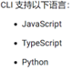

# Firebase Cloud Function
### 佈署Cloud Function(進入cmd命令提示字元)
#### 1.安裝node.js和npm
#### 2.安裝Firebase CLI
```
npm install -g firebase-tools
```
#### 3.login
```
firebase login
```
#### 4.init
```
firebase init
```
#### 5.選擇功能(選擇Functions)

#### 6.選擇要用哪個project

#### 7.語言選擇python

