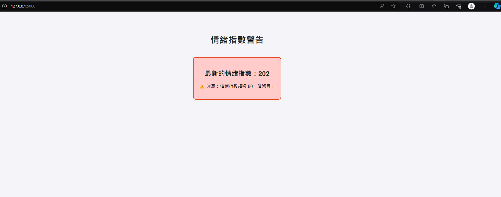

# **description**
Use Firebase Cloud Function and Cloud Messaging to implement app, linebot and web notification functions

## 三種連接方式說明
### LINE
LINE的通知傳遞方式主要根據user id來傳遞。由於沒有建構取得使用者id的功能，因此目前能使用的只有開發者的user id，意味目前的line只能傳遞給開發者本人!

### FCM 連接方式-APP
與Android app連接採用的是"特定主題發送通知"的方式，因此當主題契合時，會將通知發送給所有有訂閱這個主題的所有使用者。

### Web
與Web連接方式使用url來連接，因此，在Flask運行時，需要使用ngrok來做臨時的通道，使FCM可以透過url訪問本地Flask。

# 結果

https://github.com/user-attachments/assets/44b7ba64-3fe2-4708-acdd-823a2b6a2134

