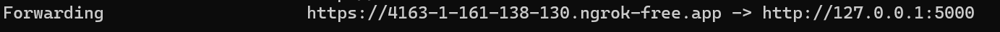

# flask
由於flask運行時的url只會在本地端，需要使用ngrok或佈署在網上來產生公開url，此次測試採用的是ngrok
### ngrok
#### 1.登入ngrok
#### 2.下載ngrok

#### 3.將ngrok解壓縮並移至flask目錄底下
#### 4.點開ngrok.exe
#### 5.驗證你的ngrok帳號
```
ngrok config add-authtoken $YOUR_AUTHTOKEN
```

#### 6.啟動ngrok(一般的flask url是127.0.0.1:5000)
```
ngrok http http://127.0.0.1:5000
```
#### 7.取得ngrok的公開url


### app.py
#### 1.安裝flask
```
pip install flask
```
使用 render_template 函數將 index.html 模板檔案呈現給用戶，同時將全域變數 `latest_emotion_index` 的值傳遞給模板，以便在網頁上顯示最新的情緒指數。
```python
@app.route('/')
def index():
    # 傳遞情緒指數給模板
    return render_template('index.html', emotion_index=latest_emotion_index)
```
Flask 應用的 /notify route，用於接收從 Cloud Function 發送的 POST 請求。
```python
@app.route('/notify', methods=['POST'])
def notify():
    global latest_emotion_index  # 確保可以修改全域變數
    data = request.get_json()
    if not data:
        return jsonify({"error": "Invalid data"}), 400

    # 解析來自 Cloud Function 的資料
    emotion_index = data.get('emotion_index')
    if emotion_index is not None:
        latest_emotion_index = int(emotion_index)  # 更新全域變數
        print(f"Received emotion index: {latest_emotion_index}")
        return jsonify({"message": "Notification received"}), 200
    else:
        return jsonify({"error": "Missing emotion index"}), 400
```
### index.html
#### 每10秒刷新一次頁面，及時更新情緒指數
```html
    <script>
        // 每10秒刷新一次頁面
        setTimeout(function(){
            window.location.reload(1);
        }, 10000);  // 10秒
    </script>

```
#### 使用 jinja 語法插入flask接收到的情緒指數並顯示在網頁上
```html
<body>
    <h1>情緒指數警告</h1>

    
    <div class="emotion-box">
        <h2>最新的情緒指數：{{ emotion_index }}</h2>
        
        <p>⚠️ 注意：情緒指數超過 80，請留意！</p>
        
        <p>情緒指數在安全範圍內。</p>
        
    </div>
    
    <p>尚未接收到情緒指數。</p>
    
</body>
```
### 啟動flask
```
python app.py
```
